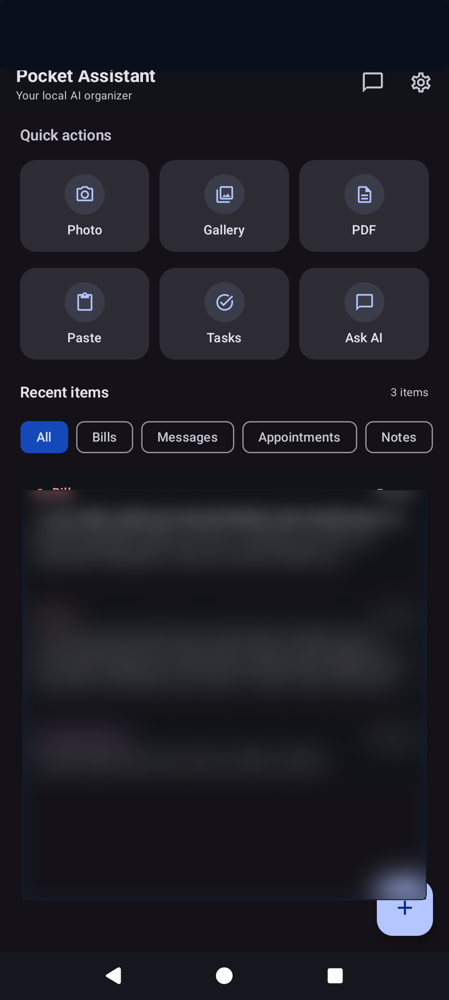
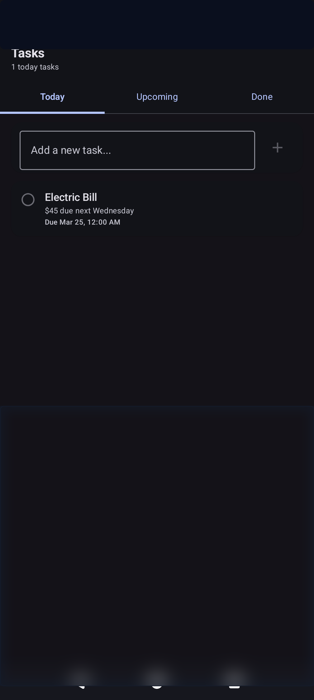
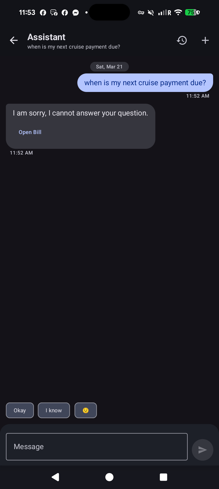
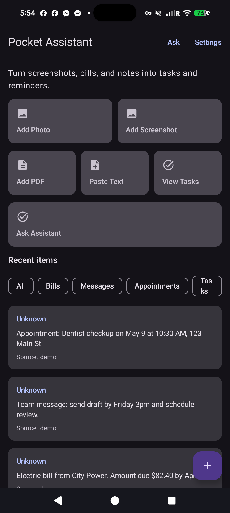
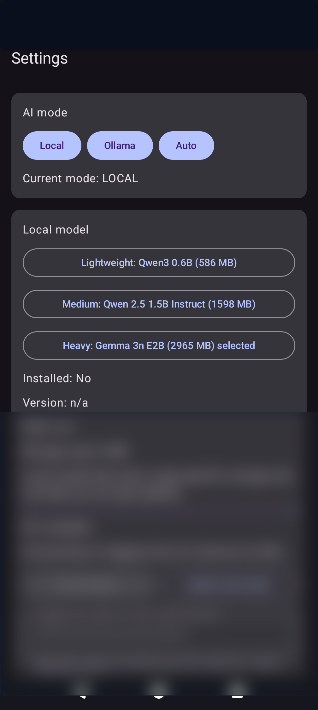
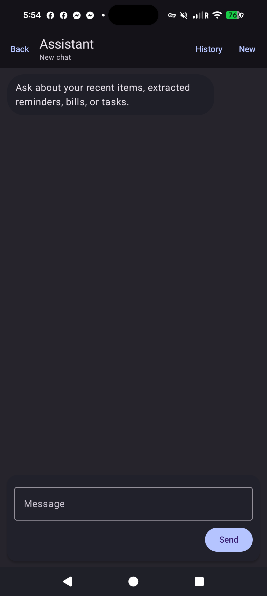

# Pocket Assistant

**Local-first AI organizer for Android** — turn screenshots, photos, PDFs, and shared text into summaries, tasks, and reminders. OCR and on-device LLM inference stay on your phone unless you configure an [Ollama](https://ollama.ai) server. No vendor-hosted backend for core features.

**Project site (GitHub Pages):** [chartmann1590.github.io/Pocket-Assistant](https://chartmann1590.github.io/Pocket-Assistant/) — download link for the latest CI-built debug APK and quick links to releases and the repo.  
After the first workflow run, enable **Settings → Pages → Build and deployment → GitHub Actions** if the site is not live yet.

  &nbsp;&nbsp;
  &nbsp;&nbsp;
  

## Features

- **Smart OCR** — ML Kit text recognition for images; PDF extraction (up to 5 pages)
- **On-device LLM** — downloadable LiteRT-LM models (Qwen3 0.6B, Qwen2.5 1.5B, Gemma 4 E2B/E4B, Gemma 3n); no internet needed after install
- **Neural semantic search** — MediaPipe Universal Sentence Encoder for natural language queries
- **RAG assistant** — ask questions about your saved items; semantic search finds context, LLM generates answers
- **Auto-extraction** — AI categorizes items as Bills, Messages, Appointments, or Notes and pulls out dates, amounts, and contacts
- **Tasks & reminders** — extracted tasks with due dates and local reminder scheduling
- **Optional Ollama** — connect to a self-hosted Ollama server for more powerful models; AUTO mode tries remote first, falls back to local
- **Privacy by design** — no cloud backend, no telemetry; everything runs offline

  &nbsp;&nbsp;
  &nbsp;&nbsp;
  

## Requirements

- **Android Studio** (recent stable) or Android SDK command-line tools
- **JDK 17** (matches `compileOptions` / `jvmTarget`)
- **Android SDK** with **API 35** for compile/target
- **minSdk 26** for running on devices

Machine-specific SDK paths belong in `local.properties`. Do not commit secrets or tokens; use in-app settings for Ollama URLs and optional API tokens.

## Build and Run

| Action | Unix / macOS | Windows |
|--------|-------------|---------|
| Debug APK | `./gradlew assembleDebug` | `.\gradlew.bat assembleDebug` |
| Install debug | `./gradlew installDebug` | `.\gradlew.bat installDebug` |
| Unit tests | `./gradlew testDebugUnitTest` | `.\gradlew.bat testDebugUnitTest` |
| Instrumented tests | `./gradlew connectedDebugAndroidTest` | `.\gradlew.bat connectedDebugAndroidTest` |
| Lint | `./gradlew lintDebug` | `.\gradlew.bat lintDebug` |

Or open in Android Studio, sync Gradle, and use **Run**.

## Ads & Building from Source

This app includes **Google AdMob** ads when published. If you build from source, **ads are disabled by default**.

1. Copy `local.properties.template` to `local.properties`
2. Set `ADS_ENABLED=false` (default) to build ad-free, or `ADS_ENABLED=true` with your own AdMob IDs
3. Build normally with `./gradlew assembleDebug`

### Reward System

When ads are enabled, users can watch rewarded video ads for ad-free credits:

| Credits | Ad-Free Time |
|---------|-------------|
| 1 | 1 hour |
| 3 | 3 hours |
| 6 | 6 hours |

Credits never expire. Ad-free time stacks.

## Project Layout

Single Gradle module `:app` (Kotlin DSL). Main code under `app/src/main/java/com/charles/pocketassistant/`:

| Area | Role |
|------|------|
| `ui/` | Compose screens, ViewModels, navigation |
| `data/` | Room, repositories, DataStore, Retrofit |
| `ai/` | Routing, local engine, Ollama client, prompts, JSON parsing, RAG |
| `ads/` | AdMob integration (banner, interstitial, rewarded) |
| `ml/` | ML Kit engines, neural embeddings, semantic search |
| `ocr/` | ML Kit + PDF rendering |
| `worker/` | Model download worker |
| `di/` | Hilt modules |
| `domain/` | Shared domain models |
| `util/` | Reminders, date parsing, helpers |

## Local Models

Model IDs, sizes, and Hugging Face settings are in `ModelConfig.kt`.

| Model | Size | Notes |
|-------|------|-------|
| Qwen3 0.6B | ~586 MB | Lightweight, fast |
| Qwen2.5 1.5B Instruct | ~1.6 GB | Good balance |
| Gemma 4 E2B IT | ~2.4 GB | Gemma 4, phone-friendly; no HF token |
| Gemma 4 E4B IT | ~3.5 GB | Larger Gemma 4; no HF token |
| Gemma 3n E2B | ~3.5 GB | Legacy gated repo; requires HF token |

## Ollama

1. Set the **base URL** in settings (e.g. `http://192.168.1.50:11434/`)
2. Optionally set an **API token** for authenticated proxies
3. Pick a **model name** from your Ollama instance
4. Use the in-app connection test before switching to OLLAMA or AUTO mode

Routing: LOCAL = on-device only, OLLAMA = remote only, AUTO = try remote first, fall back to local.

## Permissions

- `INTERNET` — model downloads, optional Ollama, ads
- `ACCESS_NETWORK_STATE` — network-aware downloads
- `POST_NOTIFICATIONS` — reminders on Android 13+
- Foreground service for reliable model downloads

## License

Specify your license here if you publish the repo publicly.
